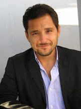

  <a href="https://scholar.google.com/citations?user=EAI9gjEAAAAJ" title="Google Scholar" aria-label="Google Scholar">
    <i class="bi bi-mortarboard-fill"></i>
  </a>
  <a href="https://orcid.org/0000-0003-0618-5846" class="orcid-icon" title="ORCID" aria-label="ORCID">
    <i class="bi bi-person-badge-fill"></i>
  </a>
  <a href="https://github.com/DrFuzzy" title="GitHub" aria-label="GitHub">
    <i class="bi bi-github"></i>
  </a>
  <a href="https://www.linkedin.com/in/kyriakos-deliparaschos-a8651b21/" title="LinkedIn" aria-label="LinkedIn">
    <i class="bi bi-linkedin"></i>
  </a>

## Welcome

I am a Special Teaching Staff member at the Department of Electrical Engineering, Computer Engineering, and Informatics, Cyprus University of Technology.

My work focuses on VLSI/FPGA design, embedded systems, hardware acceleration, cyber-physical systems, robotics, control, and edge-computing applications.

This website includes information about my research, publications, teaching activities, course material, and contact details.

[Research](research_interests.qmd){.btn .btn-primary}
[Publications](publications.qmd){.btn .btn-primary}
[Teaching](current_courses.qmd){.btn .btn-primary}
[Service](professional_service.qmd){.btn .btn-primary}
[Contact](contact_info.qmd){.btn .btn-primary}

## Brief biography

Dr Kyriakos M. Deliparaschos is a Senior Member of the IEEE. He received his B.Eng. (Hons) degree in Electronics Engineering and his M.Sc. degree in Mechatronics from De Montfort University, UK, and the National Technical University of Athens (NTUA), Greece. He earned his Ph.D. degree from the Department of Signals, Control and Robotics, School of Electrical and Computer Engineering, NTUA.

He is currently a Special Teaching Staff member in the Department of Electrical Engineering, Computer Engineering, and Informatics at the Cyprus University of Technology (CUT). He has held academic and research positions at the National Technical University of Athens, Greece, New York College and IST College in Athens, Greece, the Cyprus University of Technology, Trinity College Dublin, Ireland, and Cranfield University, UK.

His research interests include FPGA/SoC design, embedded and cyber-physical systems, hardware acceleration, robotic and UAV systems, and robot-assisted surgery. His work has been published in peer-reviewed international journals, conferences, and book chapters in the areas of robotics, control, electronics, embedded systems, and digital hardware design.

